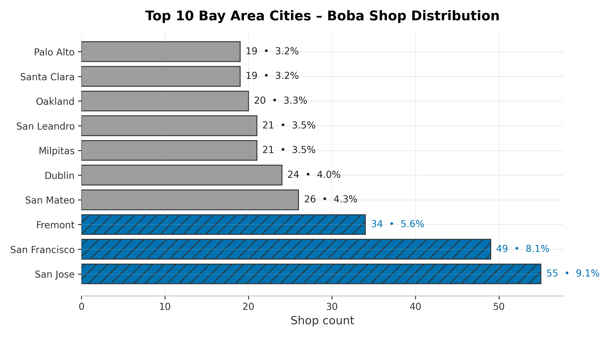

# Bay Area Boba EDA — What Makes a 5★ Cup?

> Exploring pricing, ratings, and location patterns across Bay Area boba shops.

## **Overview**

This project explores 603 Bay Area boba shops using Yelp data to answer a simple question:

What factors are linked to better ratings?

We combine EDA, clustering, and hypothesis testing to identify how location, competition, and shop type affect performance.

The results can help entrepreneurs, investors, or operators make informed decisions on where and how to expand in the Bay Area.

## **Data**

Source: Yelp listings (public dataset, cleaned for consistency).

Core fields: name, city, lat, lon, rating

Derived features:

is_chain → shop appears ≥2 times in dataset

urban → shop in SF, San Jose, Oakland, Berkeley, Palo Alto

near_campus → within 2 miles of a major Bay Area campus

nn_xmi → count of neighbors within 0.5, 1.0, and 2.0 miles

## **Methods**

### 1. Exploratory Analysis

City-level shop counts and rating distributions

Visualizations of top cities and shop clusters

### 2. Clustering (k-Means)

Tested k=2–10, compared with silhouette scores

Revealed macro, meso, and micro structure of the market

Identified high-performing hubs (SF, SJ, Palo Alto) vs oversaturated zones (Santa Clara, Dublin)

### 3. Hypothesis Testing

Welch’s t-tests for binary factors (urban, chain, campus proximity)

Effect sizes (Cohen’s d, Hedges’ g) + bootstrap confidence intervals

Multiple regression to adjust for overlap across factors

Competition density (nearest neighbors) tested as an additional predictor

## **Key Findings**

Urban advantage: Urban shops average +0.2 stars higher (p < 0.001).

Chains underperform: Chains score –0.1 stars lower than independents (p < 0.01).

Campus effect negligible: No significant rating boost near universities.

Competition density: More neighbors doesn’t guarantee higher ratings; oversupply can dilute quality.

## **Recommendations**

For anyone considering opening a shop:

Best bets: SF, San Jose, and Palo Alto remain strong, premium clusters.

Watch out: Santa Clara & Dublin show oversupply with weaker averages.

Differentiation matters: Independent shops have a reputational edge — quality and uniqueness pay off.

## **Next Steps**

This project focused on shop ratings, competition, and basic location signals. To make it even more actionable, the following extensions would strengthen insights:

### 1. Pricing & Menu Data

Scrape menu prices and product offerings (milk tea vs fruit tea vs toppings).

Test whether higher-priced shops correlate with higher ratings, or if affordability drives volume.

### 2. Sentiment Analysis of Reviews

Use NLP on Yelp review text to extract themes (service, taste, ambiance).

Link those themes to rating differences to uncover why shops perform better.

### 3. Temporal Dynamics

If review timestamps are available, analyze trends over time (e.g., Do ratings decline as shops scale?).

### 4. Customer Demographics & Foot Traffic

Incorporate census and mobility data for neighborhoods.

Identify whether ratings align with income levels, age distribution, or cultural density.

### 5. Predictive Modeling

Build a model to predict whether a new shop (given location + chain status + proximity to campus/competitors) would likely be above or below 4.0 stars.

### 6. Expansion Simulation

Run “what-if” experiments: if a new shop opens in Fremont vs Palo Alto, how might the local density vs. quality balance shift?

## **Tech Stack**

Python 3.11

pandas, numpy – data wrangling

matplotlib, seaborn – visualization

scikit-learn – clustering & nearest-neighbors

statsmodels, scipy – hypothesis testing & regression

jupyterlab – reproducible analysis

## **Project Files**

notebooks/eda.ipynb → full exploratory analysis + hypothesis testing

data/bayarea_boba_spots.csv → cleaned dataset

assets/ → saved figures for report

